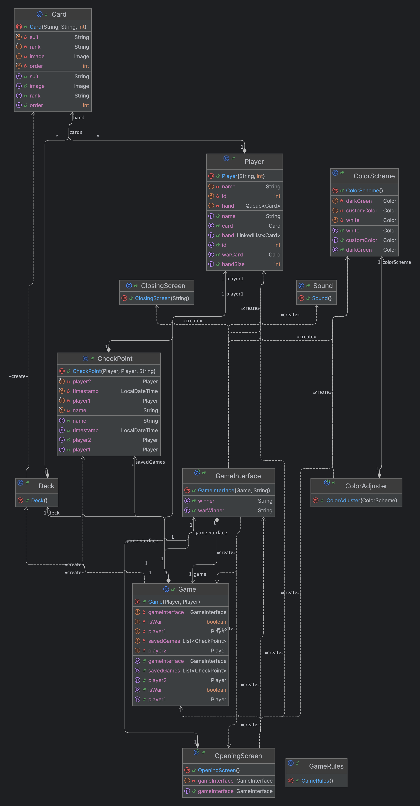
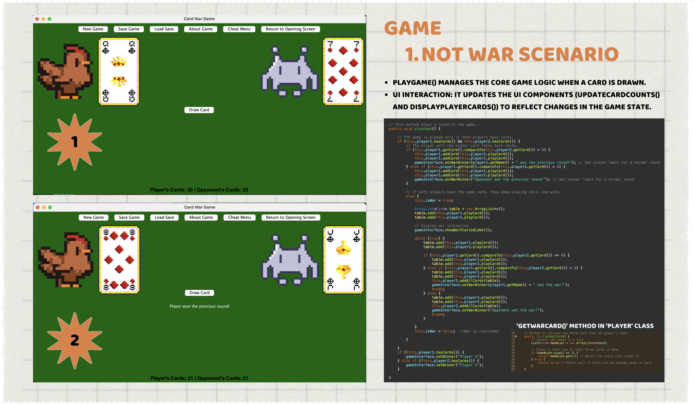
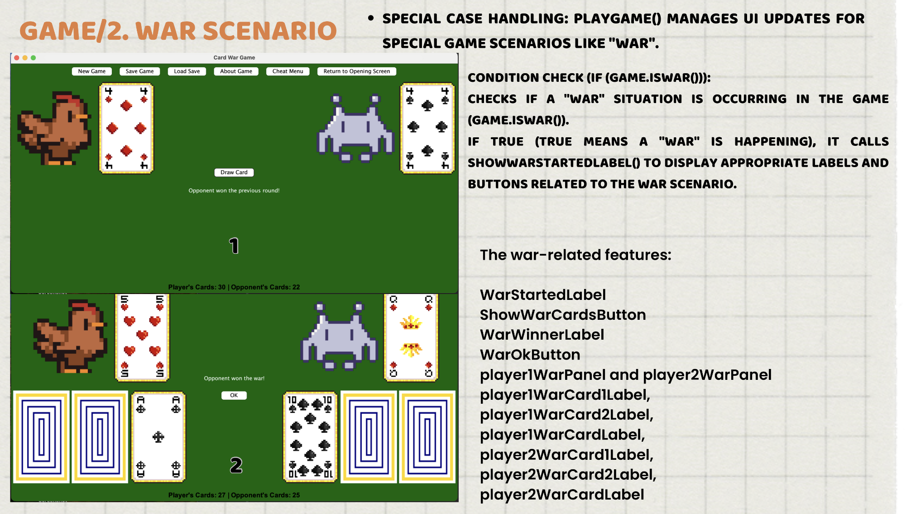
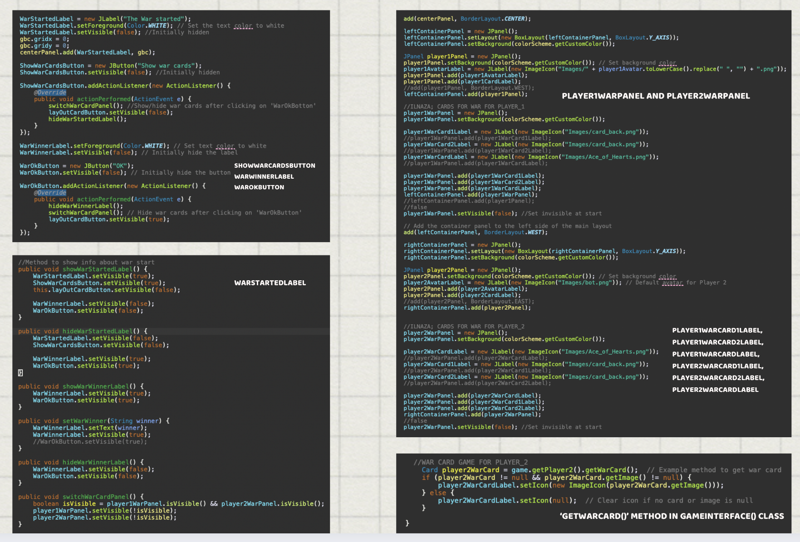

# 🃏 War Card Game – Java OOP Project

## 📦 Overview
This project is a **card game simulation** built using **Java and OOP principles**.  
Players engage in a **War card game**, where they draw and compare cards, with special **"War" rounds** implemented.

---

## 🏗️ Project Architecture

The following diagram illustrates the **game's structure**, including classes, relationships, and interactions.

---

## 📖 Game Rules

To understand how **War Card Game** works, you can check the **official rules here:**
[War Card Game Rules](https://bicyclecards.com/how-to-play/war/)

---

## 🎯 Features

- 🃏 **Standard and War rounds** fully implemented  
- 🎨 **Graphical User Interface (GUI)** with interactive elements  
- 🔄 **Game saving/loading** with checkpoints  
- 🔊 **Sound effects for game actions**  
- 🛠️ **Java OOP principles** (Encapsulation, Inheritance, Polymorphism)  

---

## 🧰 Technologies & Tools

- **Java 17** – Core language  
- **Java Swing** – GUI development  
- **Object-Oriented Programming (OOP)** – Game logic  
- **MVC Architecture** – Separation of logic and UI  
- **Image Assets** – Custom card images  

---

## 👩‍💻 My Contribution

I **designed and implemented the War Round from scratch**, handling both **backend logic** and **frontend UI updates**, making this a **beginner-level full-stack project**.

### **Backend (Game Logic)**
- Developed **War round mechanics**, ensuring the game correctly identifies and executes **"War" scenarios**  
- Implemented **round outcome logic**: determining the winner, redistributing cards, and handling tie-breaking conditions  
- Added **state checks** to ensure proper flow between **standard rounds** and **War rounds**  

### **Frontend (Game UI)**
- Created **visual elements** for the **War round** (e.g., three additional cards displayed during War)  
- Implemented **UI updates** to dynamically reflect game state changes  
- Found and integrated **custom card assets**  
- Managed **button interactions** and **animations** during War  

This project helped me **develop full-stack skills**, from **backend logic implementation** to **UI interaction and design**.

 ---

## 🖥️ Game Implementation

### 🔹 Normal Round  
A standard game round where players draw one card each.

### 🔹 War Round  
Special UI update when a **war round** is triggered.

### 🔹 War Round Code Implementation  
Snippet showing how **War Round mechanics** were implemented.

---

## 📂 File Structure
- Pictures
  - Project_Architecture.png
  - code.png
  - meme.png
  - war-activator.png
  - war-round.png
- cards
  - Card.java
  - Deck.java
- game
  - CheckPoint.java
  - Game.java
  - Player.java
- gui
  - ClosingScreen.java
  - ColorAdjuster.java
  - ColorScheme.java
  - GameInterface.java
  - GameRules.java
  - OpeningScreen.java
  - Sound.java
- module-info.java
- LICENSE
- README.md
